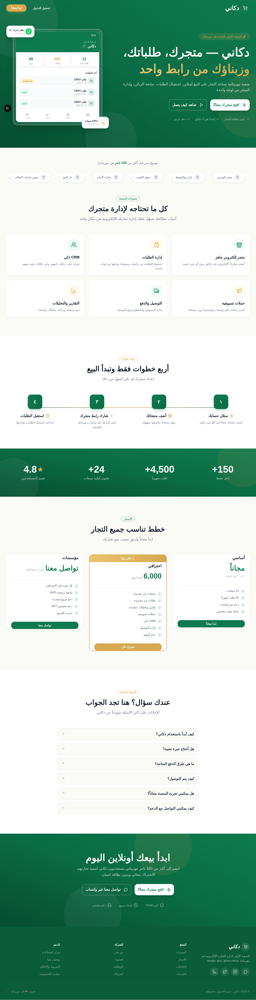
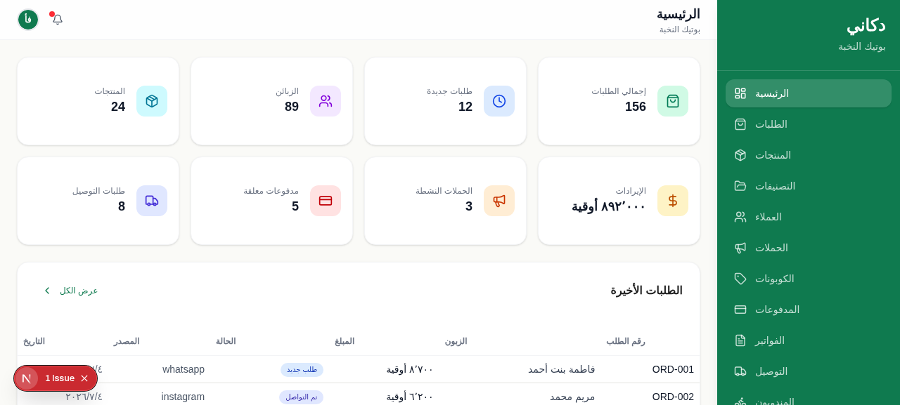
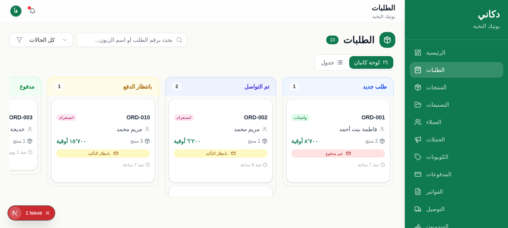
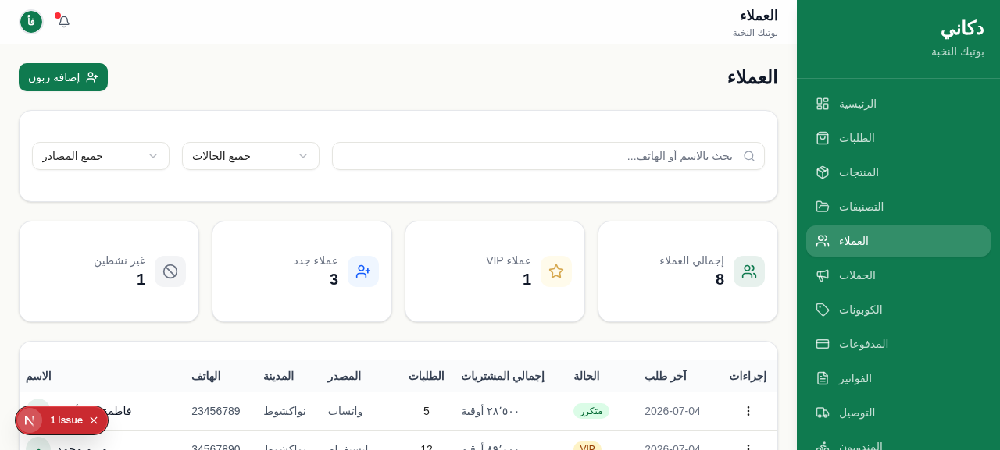
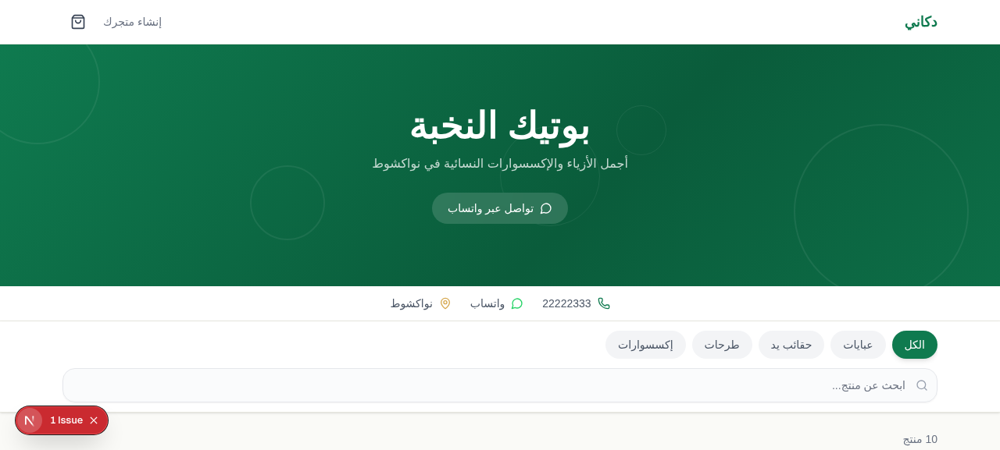
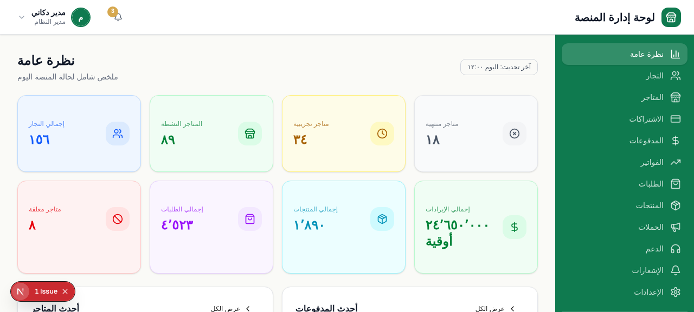

# 🏪 Dokani — Mauritanian E-Commerce SaaS Platform

<p align="center">
  <strong>دكاني</strong> — A full-featured e-commerce platform built for merchants in Mauritania.
</p>

---

## 🌍 Overview

Dokani is a SaaS platform that enables Mauritanian merchants to create and manage their own online stores with ease. The platform is fully in **Arabic (RTL)** and supports local payment methods unique to Mauritania (Bankily, Sedad, Masrvi, BIM Bank, Click), WhatsApp-based commerce workflows, and delivery management — all tailored for the local market.

---

## ✨ Key Features

### 🏠 Landing Page
- Professional marketing page with feature highlights, pricing tiers, and sign-up flow
- Animated hero section with brand colors (green & gold)

### 🔐 Authentication & Onboarding
- **Login / Signup / Forgot Password** — Clean card-based forms with inline validation
- **4-Step Onboarding Flow:**
  1. Account confirmation (pre-filled data)
  2. Store info (name, type, city, WhatsApp, logo upload, language)
  3. Initial products setup (with skip option)
  4. Celebration page with store URL, copy & WhatsApp share buttons

### 📊 Merchant Dashboard
- Real-time stats: revenue, orders, customers, products
- **Orders Module** — Kanban board with 11 order statuses (new → delivered/cancelled), drag-and-drop
- **Customers (CRM)** — Contact management with status tracking (new, repeat, VIP, inactive)
- **Products & Categories** — Full CRUD with images, sizes, colors, pricing
- **Campaigns & Coupons** — Marketing campaign management across WhatsApp, Instagram, Facebook, TikTok
- **Delivery Zones & Agents** — Area-based delivery fees, agent assignment, live delivery tracking

### 🏗️ Store Builder
- **Identity** — Logo, colors, store name & description
- **Homepage Sections** — Drag-and-drop section layout (hero, products, categories, testimonials, etc.)
- **Pages** — Static page management (About, Policy, Terms, etc.) with show-in-footer toggle
- **Social Links** — Facebook, Instagram, TikTok, Snapchat, WhatsApp, YouTube, Telegram
- **Live Preview** — Real-time store preview before publishing

### 💰 Accounting Module
- **Overview** — Revenue, expenses, and profit summary with charts
- **Payment Methods** — Configure local payment methods (Bankily, Sedad, Masrvi, BIM Bank, Click, Cash)
- **Payment Review** — Verify customer payment receipts and confirm/reject payments
- **Transactions** — Full transaction ledger with filtering and export
- **Reports** — Financial reports with date range selection

### 🛍️ Storefront (Customer-Facing)
- Product browsing with category filtering
- Shopping cart with quantity management
- **Checkout** — Payment method selection with local methods, manual transfer instructions, receipt upload
- Footer with page links and social media icons

### ⚡ Automation Engine
- Rule-based triggers: new order, payment confirmed, delivery status changes, etc.
- Actions: send WhatsApp message, change status, add tag, show notification
- Configurable per-store automation rules

### 👤 Platform Admin Dashboard
- Merchant management and billing
- Platform-wide payment method configuration
- Invoice management (Bankily, Masrvi, Cash payments)
- System statistics and monitoring

---

## 🏗️ Architecture

### Tech Stack

| Layer | Technology |
|-------|-----------|
| **Framework** | Next.js 16 (App Router) |
| **Language** | TypeScript |
| **Frontend** | React 19 + Tailwind CSS 4 |
| **UI Components** | shadcn/ui (40+ components) |
| **State Management** | Zustand |
| **Database** | Prisma ORM + SQLite |
| **Charts** | Recharts |
| **Animations** | Framer Motion |
| **Drag & Drop** | dnd-kit |
| **Forms** | React Hook Form + Zod |
| **Tables** | TanStack Table |
| **Auth** | NextAuth.js |

### Database Schema (20+ Models)

```
PlatformUser → Store → Product, Category, Order, Customer
                     → Campaign, Coupon, DeliveryZone, Branch
                     → StorePage, StoreSocialLink, StoreThemeSetting
                     → PaymentMethod, PaymentReceipt, AccountingTransaction
                     → Automation, Invoice, MessageLog
Order → OrderItem, DeliveryUpdate, DeliveryAssignment
```

### Project Structure

```
src/
├── app/
│   ├── page.tsx              # Main router (view-based navigation)
│   ├── layout.tsx            # Root layout
│   └── globals.css           # Global styles + Tailwind
├── components/
│   ├── landing/              # LandingPage
│   ├── auth/                 # AuthPages (login, signup, forgot-password)
│   ├── onboarding/           # OnboardingFlow (4 steps)
│   ├── merchant/             # MerchantDashboard, StoreBuilder, AccountingModule, AdditionalModules
│   ├── admin/                # AdminDashboard
│   ├── storefront/           # StorefrontPage
│   ├── orders/               # OrdersModule
│   └── ui/                   # shadcn/ui components (40+)
├── lib/
│   ├── store.tsx             # Zustand state management + 20+ view types
│   ├── types.ts              # 30+ TypeScript interfaces
│   ├── demo-data.ts          # Demo/mock data
│   ├── utils.ts              # Utility functions
│   └── db.ts                 # Prisma client
└── hooks/                    # Custom React hooks
```

---

## 🎨 Design System

| Token | Value | Usage |
|-------|-------|-------|
| **Primary** | `#0F7A4F` | Buttons, links, accents |
| **Gold** | `#D6A84F` | Highlights, badges, CTA |
| **Background** | `#FAFAF7` | Page backgrounds |
| **WhatsApp** | `#25D366` | WhatsApp-related elements |
| **Typography** | Arabic-first | Full RTL layout |
| **Radius** | `rounded-2xl` | Cards and containers |
| **Shadows** | Soft, layered | Depth without heaviness |

All text is in **Arabic** with **RTL layout** throughout the entire application.

---

## 🇲🇷 Mauritania-Specific Features

- **Local Payment Methods**: Bankily, Sedad, Masrvi, BIM Bank, Click — with account details and receipt upload
- **WhatsApp Commerce**: Deep integration with WhatsApp for order notifications, customer communication, and marketing
- **Delivery Zones**: City and area-based delivery fee calculation
- **Arabic-First**: All interfaces, labels, and data in Arabic with RTL layout
- **Manual Payment Flow**: Customer uploads receipt → Merchant reviews → Confirms/Rejects

---

## 🚀 Getting Started

### Prerequisites
- Node.js 18+ or Bun
- npm/bun package manager

### Installation

```bash
# Clone the repository
git clone https://github.com/cheikhMoustaph/Dokani-Rim.git
cd Dokani-Rim

# Install dependencies
bun install

# Set up the database
bun run db:push

# Start development server
bun run dev
```

The app will be available at `http://localhost:3000`.

### Environment Variables

Create a `.env` file:

```env
DATABASE_URL="file:./db/custom.db"
```

---

## 📦 Build & Deploy

```bash
# Production build
bun run build

# Start production server
bun run start
```

---

## 📸 Screenshots

| Landing Page | Merchant Dashboard | Orders Kanban |
|:---:|:---:|:---:|
|  |  |  |

| Customers | Storefront | Admin Dashboard |
|:---:|:---:|:---:|
|  |  |  |

---

## 📄 License

This project is proprietary software. All rights reserved.

---

<p align="center">
  Built with ❤️ for the Mauritanian market — <strong>دكاني</strong>
</p>
